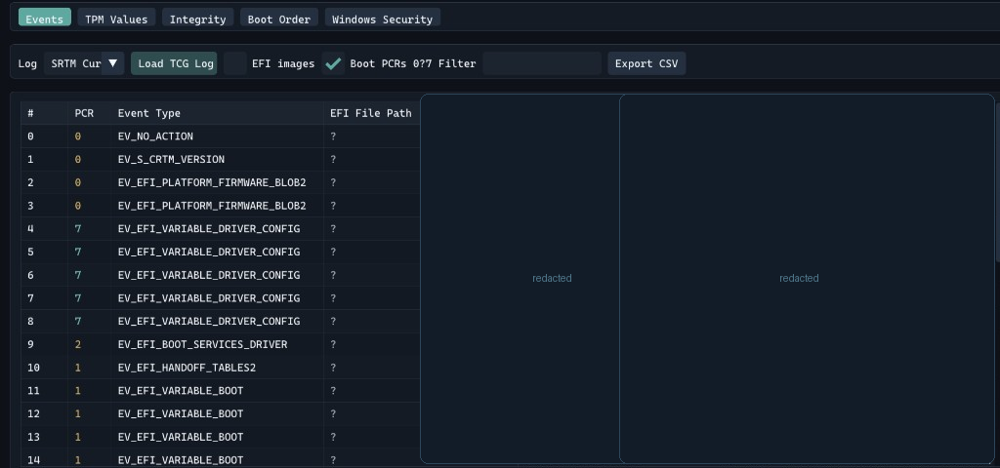
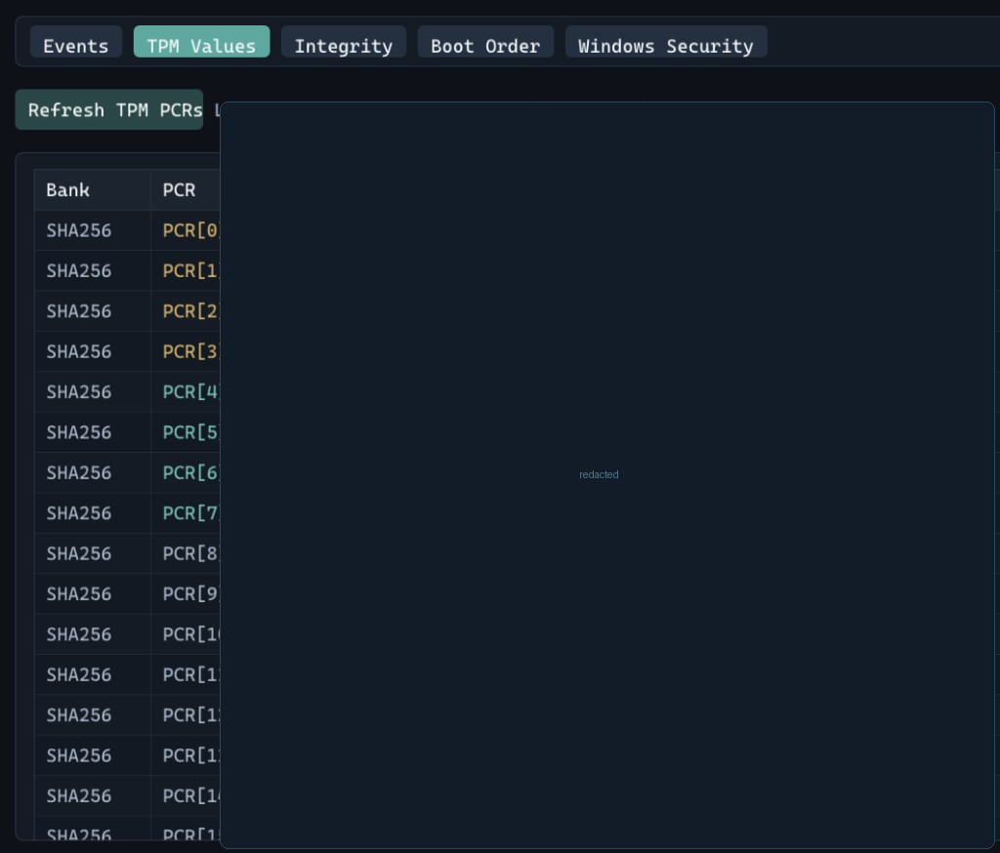
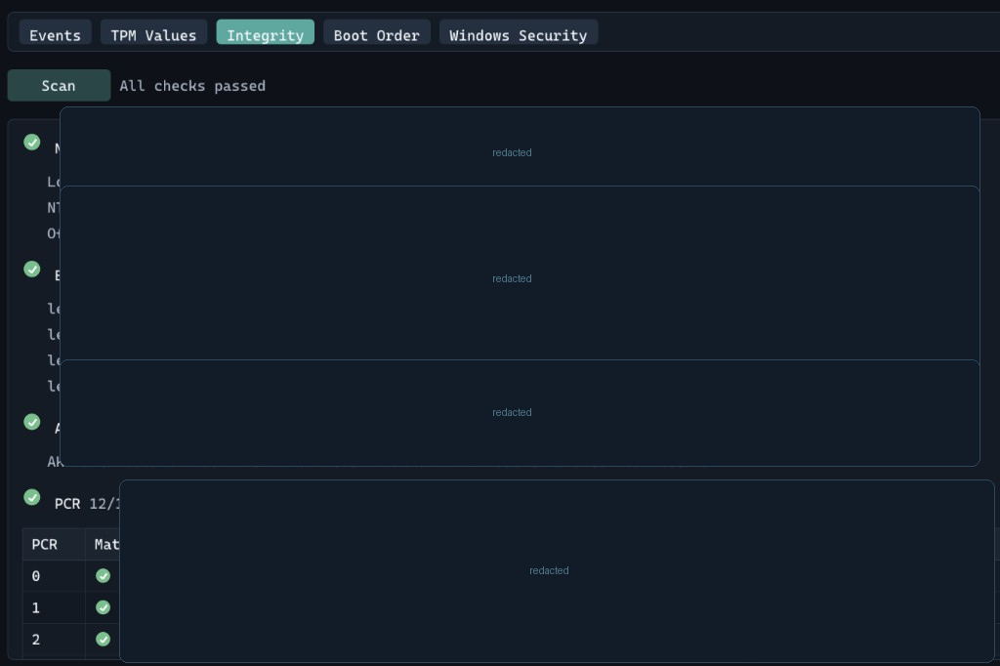
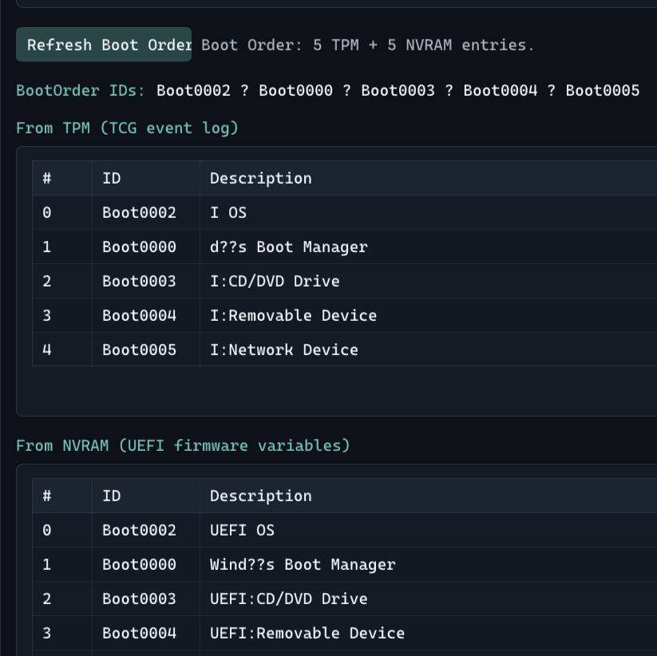
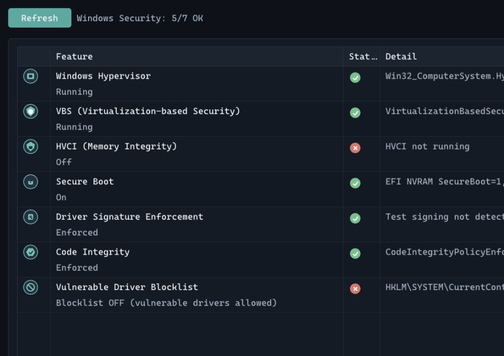

<p align="center">
  
</p>

<h1 align="center">TcgBootLog</h1>

<p align="center">
  <strong>Measured Boot · TPM · Windows Security</strong><br/>
  Live TCG event log viewer, PCR banks, integrity replay, boot order, and OS security posture — in one dark toolkit UI.
</p>

<p align="center">
  
  
  
  
</p>

---

## Screenshots

> Digests, PCR values, EK/AK identifiers, and other machine-traceable fields are **redacted** in these shots.

### Events — TCG / Measured Boot log

Parse the live SRTM log, filter boot PCRs, export CSV. EFI paths and UEFI variable events (SecureBoot, PK, KEK, db, dbx, Boot####) in one table.



### TPM Values — PCR banks

Read SHA-256 (and SHA-1) PCR 0–23 straight from the TPM.



### Integrity — NTP · EK · AK · PCR replay

Progressive scan: clock skew, Endorsement Key chain, Attestation Key probe, then replay event digests into PCRs and compare with the chip.



### Boot Order — TPM log vs UEFI NVRAM

Side-by-side Boot#### entries from the TCG log and firmware variables.



### Windows Security — live OS posture

Hypervisor, VBS, HVCI, Secure Boot (**EFI NVRAM**), driver signature enforcement, code integrity, and vulnerable-driver blocklist.



---

## Features

| Page | What it does |
|------|----------------|
| **Events** | `Tbsi_Get_TCG_Log_Ex` → full event table, EFI path decode, filters, CSV |
| **TPM Values** | Live PCR banks via TBS |
| **Integrity** | NTP skew → EK certs → AK → PCR replay match |
| **Boot Order** | TCG boot events + `GetFirmwareEnvironmentVariableEx` |
| **Windows Security** | DeviceGuard / WMI + registry + EFI `SecureBoot` / `SetupMode` |

## Requirements

- Windows 10/11 with TPM 2.0
- .NET 10 SDK (to build)
- **Run as Administrator** (TBS + EFI NVRAM privilege)

## Build & run

Open **`TcgBootLog.sln`** in Visual Studio / Rider / VS Code, or from a terminal:

```powershell
dotnet restore TcgBootLog.sln
dotnet build TcgBootLog.sln -c Release
Start-Process .\bin\Release\net10.0-windows\TcgBootLog.exe -Verb RunAs
```

Prebuilt binaries are on the [Releases](https://github.com/JonasAW10/TcgBootLog/releases) page (run as Administrator).

## Stack

- **.NET 10** + Silk.NET (OpenGL 3.3)
- **ImGui.NET** UI
- **Microsoft.TSS** / TBS for TPM & TCG log
- **System.Management** for DeviceGuard WMI
- Win32 EFI NVRAM (`SeSystemEnvironmentPrivilege`)

## Privacy note

Screenshots in this README intentionally blur PCR digests, EK/AK material, firmware image locations, and similar values that can fingerprint a machine. Do not publish raw TPM dumps from your own host if you care about trackability.

---

<p align="center">
  <sub>Built for people who actually look at PCR 7.</sub>
</p>
